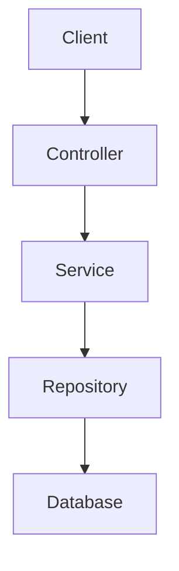
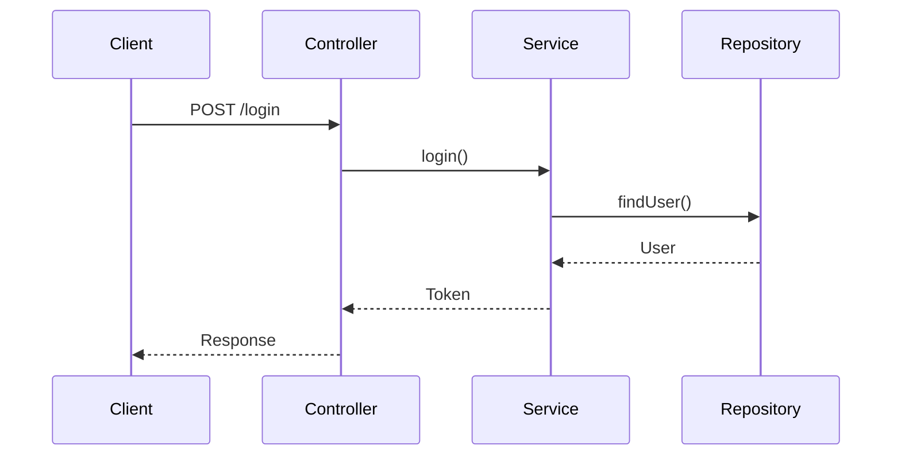
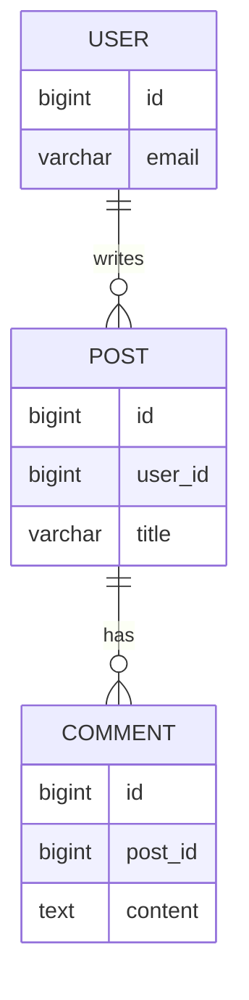
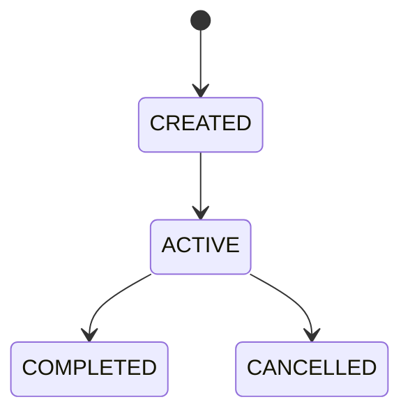
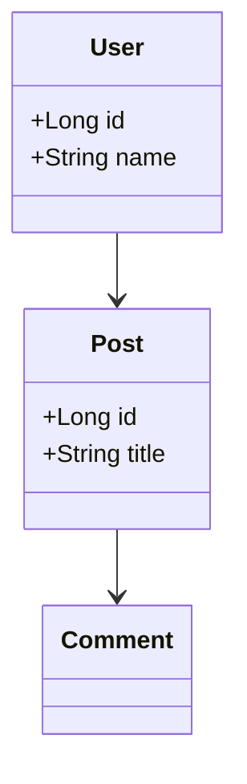
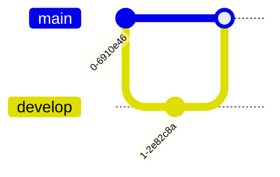

# 개발 학습 관리

예시

## Java

| 주제      | 상태 | 이해도 | 문서                        |
| --------- | ---- | ------ | --------------------------- |
| Exception | 완료 | 높음   | [정리](./java/exception.md) |
| Stream    | 완료 | 보통   | [정리](./java/stream.md)    |

## Spring

| 주제        | 상태   | 이해도 | 문서                            |
| ----------- | ------ | ------ | ------------------------------- |
| Transaction | 완료   | 높음   | [정리](./spring/transaction.md) |
| Security    | 진행중 | 보통   | [정리](./spring/security.md)    |

## JPA

| 주제 | 상태 | 이해도 | 문서                        |
| ---- | ---- | ------ | --------------------------- |
| N+1  | 완료 | 높음   | [정리](./jpa/n-plus-one.md) |
| Lock | 예정 | -      | -                           |

# Markdown 문법 정리

## 1.제목

# 제목 1

## 제목 2

### 제목 3

#### 제목 4

##### 제목 5

###### 제목 6

```
# Spring Security 정리
## 1. 개념
## 2. 인증
## 3. 인가
## 4. JWT
## 5. 프로젝트 적용
```

## 2.일반 텍스트

Spring Boot는 Java 기반의 서버 애플리케이션 개발을 위한 프레임워크다.

REST API를 구현할 때 Controller, Service, Repository 계층을 사용한다.

첫 번째 문단입니다.

두 번째 문단입니다.

## 3.줄바꿈

첫 번째 줄<br>
두 번째 줄

## 4.굵기

**굵은 글씨**

**굵은 글씨**

## 5.기울기

_굵은 글씨_

_굵은 글씨_

## 6.굵기+기울기

**_굵은 글씨_**

## 7.취소선

~~삭제할 내용~~

## 8.인라인 코드

`@Transactional`

## 9.코드 블록

여러 줄 코드는 백틱 3개를 사용한다.

```
const user = {
    name: "홍길동"
};
```

## 10. 코드 언어 지정

개발 문서에서는 언어를 반드시 지정하는 것을 추천한다.

```java
public class User {
    private Long id;
}
```

대표적인 언어:

```
java
javascript
typescript
python
sql
html
css
json
xml
yaml
bash
shell
jsx
tsx
```

## 11. 순서 없는 목록

- Java
- Spring
- JPA
- PostgreSQL

## 12. 하위 목록

들여쓰기를 이용한다.

- Backend
  - Java
  - Spring
  - JPA
- Database
  - PostgreSQL
  - Oracle

## 13. 순서 있는 목록

1. 요구사항 분석
2. DB 설계
3. Entity 설계
4. DTO 설계
5. Repository 설계
6. Service 설계
7. Controller 설계
8. 테스트

## 14. 중첩된 번호 목록

1. Backend
   1. Controller
   2. Service
   3. Repository
2. Database
   1. Entity
   2. Index

## 15. 체크박스

GitHub README에서 매우 유용하다.

- [ ] 학습 예정
- [x] 학습 완료

## 16. 링크

기본 링크:
[GitHub](https://github.com/)

## 17. 링크 + 설명

[Spring Boot 공식 문서](https://spring.io/projects/spring-boot)

## 19. 이메일 링크

[Email](mailto:example@example.com)

## 20. 이미지

기본 문법:


예:


## 21. 이미지 크기 조절 + 정렬(HTML 사용)

순수 Markdown에는 이미지 크기를 지정하는 표준 문법이 없다.
GitHub에서는 HTML을 사용할 수 있다.

둘 다:

<p align="center">
  
</p>

## 23. 링크 + 이미지
이미지를 클릭하면 링크로 이동하도록 만들 수 있다.

[](https://github.com/)

## 24. 인용문
> 이것은 인용문입니다.

결과:
이것은 인용문입니다.
여러 줄:
> 첫 번째 줄
> 두 번째 줄
> 세 번째 줄

## 25. 중첩 인용
> 첫 번째 인용
>
> > 두 번째 인용

## 26. 수평선
---
또는:
***

## 27. 표 !!
개발 문서에서 매우 중요하다.

| 기술 | 설명 |
|---|---|
| Java | 프로그래밍 언어 |
| Spring Boot | 백엔드 프레임워크 |
| PostgreSQL | 관계형 데이터베이스 |


## 28. 표 정렬

왼쪽:
| 기술 | 설명 |
|:---|:---|

가운데:
| 기술 | 설명 |
|:---:|:---:|

오른쪽:
| 기술 | 설명 |
|---:|---:|


예:
| 기술 | 설명 | 상태 |
|:---|:---:|---:|
| Java | Backend | 완료 |
| Spring | Framework | 진행중 |
| PostgreSQL | Database | 예정 |

1. 표에 긴 설명을 넣으면 모바일에서 가독성이 상당히 떨어진다. - 긴 설명은 일반 문단이나 별도 섹션으로 빼는 게 좋다.
2. 표 안에 링크를 넣을 수 있다


## 34. 세부정보 / 접기 !!

GitHub README에서 상당히 유용하다.

<details>
<summary>자세히 보기</summary>

여기에 숨길 내용을 작성한다.(text)- 코드, 표 가능

```java
public class User {
    private Long id;
}
```
| Method | Endpoint | 설명 |
|---|---|---|
| GET | `/users` | 사용자 조회 |
| POST | `/users` | 사용자 생성 |

</details>

## 40. 특수문자 표시

Markdown 문법으로 해석되는 문자를 그대로 표시하려면 \를 사용한다.

\*별표\*
결과:
*별표*

대표적으로:
\*
\_
\#
\`
\[
\]

## 41. 백틱 자체 표시
코드에서 백틱을 보여줘야 한다면 백틱을 여러 개 사용할 수 있다.

`` `code` ``

## 42. 파일 경로 표현

개발 문서에서 추천:

`src/main/java/com/example/user/UserService.java`

## 43. 디렉터리 구조 !!

```text
src
├── main
│   ├── java
│   └── resources
└── test
```

## 44. Mermaid 다이어그램 !!


## 45. Mermaid Sequence Diagram !!

API 흐름을 표현하기 좋다.



## 46. Mermaid ERD

데이터베이스 관계를 표현할 수도 있다.



47. Mermaid State Diagram

상태 흐름을 표현할 때:



48. Mermaid Class Diagram

클래스 관계를 표현할 수 있다.


49. Mermaid Git Graph

Git 흐름을 표현할 수도 있다.


50. 목차

Markdown 자체에서 자동 목차 문법이 완전히 통일되어 있는 것은 아니다.

간단하게 직접 작성할 수 있다.

## 목차

- [1. 프로젝트 소개](#1-프로젝트-소개)
- [2. 기술 스택](#2-기술-스택)
- [3. 아키텍처](#3-아키텍처)
- [4. 문제 해결](#4-문제-해결)

63. HTML 표

Markdown 표보다 복잡한 레이아웃이 필요하면 HTML을 사용할 수도 있다.

<table>
  <tr>
    <th>기술</th>
    <th>역할</th>
  </tr>
  <tr>
    <td>Spring Boot</td>
    <td>API 서버</td>
  </tr>
</table>