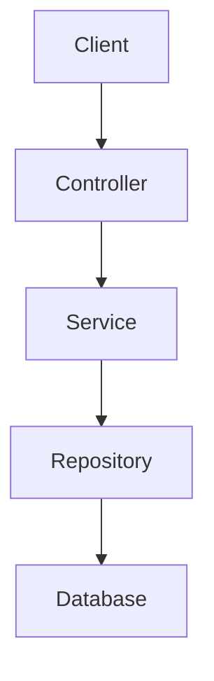
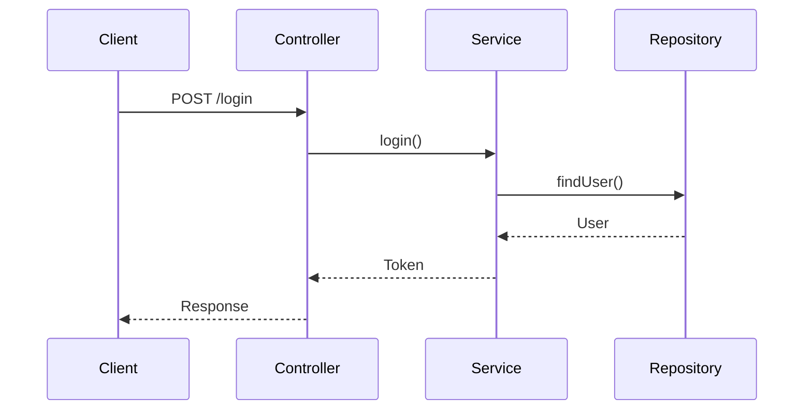
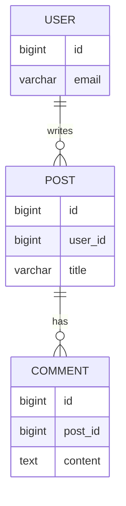
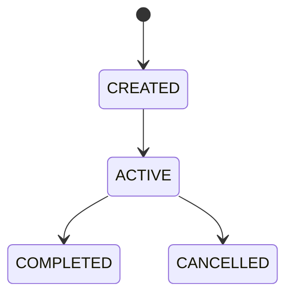
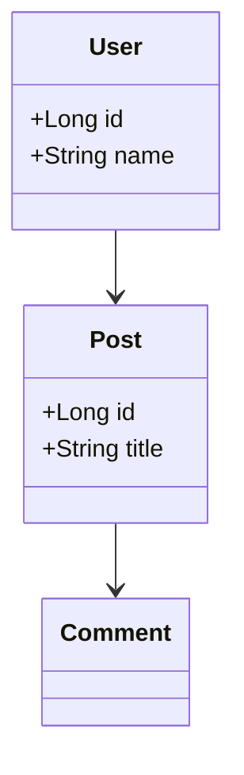
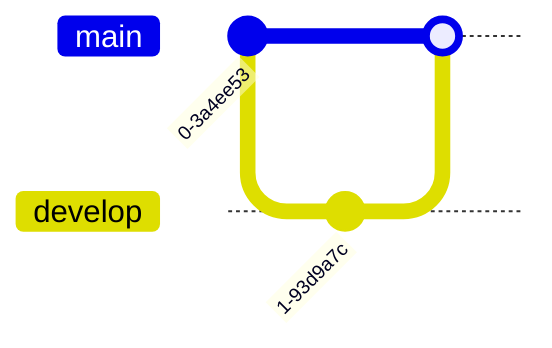

## 44. Mermaid 다이어그램 !!

## 45. Mermaid Sequence Diagram !!

API 흐름을 표현하기 좋다.

## 46. Mermaid ERD

데이터베이스 관계를 표현할 수도 있다.

47. Mermaid State Diagram

상태 흐름을 표현할 때:

48. Mermaid Class Diagram

클래스 관계를 표현할 수 있다.

49. Mermaid Git Graph

Git 흐름을 표현할 수도 있다.

