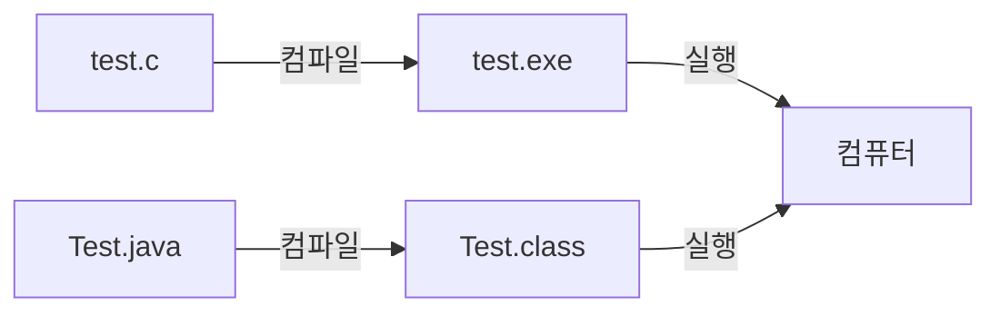
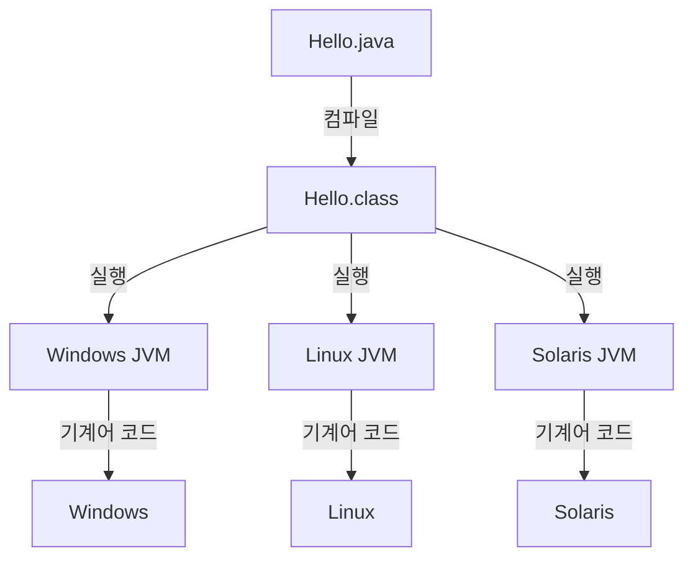

# 자바 프로그래밍 시작

<!-- | 기술 | 설명 |
|---|---| -->

자바 프로그램을 개발하기 전에 반드시 알아야 하는 기본적인 내용을 학습해봅니다.

1. 자바 프로그램의 개발 순서 : `소스 파일 → 컴파일 → 실행파일 →실행`

2. 자바 가상 머신 : `JVM(Java Virtual Machine)`

 자바가 다른 언어와 가장 다른 점은 이 JVM이 자바 프로그램을 실행한다는 것입니다. 그래서 자바프로그램을 개발하려는 우리는 반드시 JVM을 설치해야 합니다.
그리고 추가로 오라클 웹 사이트에서 자바 개발 도구를 내려받아 설치하고 환경변수를 설정합니다. 이렇게 개발 준비가 완료되면 간단한 자바 프로그램을 구현해보고 실행해보겠습니다.


## 프로그래밍에 필요한 기본 지식

- 프로그램이란? <br>
**프로그램(program) 은 컴퓨터가 특정 작업을 수행하도록 만든 명령어들의 집합이다.**
컴퓨터는 CPU, 메모리, 입출력 장치, 저장 장치 등 여러 장치로 구성되어 있습니다. 프로그램은 이러한 장치들이 어떤 순서로 동작해야 하는지 알려주는 작
업 지시서라고 볼 수 있다.
- 명령어란? <br>
**명령어(instruction) 는 컴퓨터에게 전달하는 지시이다.**
사람과 대화하듯 주고받는 것이 아니라, 개발자가 컴퓨터에게 일방적으로 작업을 지시하는 것입이다. 따라서 컴퓨터는 개발자가 작성한 명령어의 순서와
내용에 따라 동작한다.
- 프로그래밍 언어란? <br>
컴퓨터에게 명령을 전달하려면 사람이 이해할 수 있는 형태로 명령어를 작성해야 한다. 이때 사용하는 도구가 **프로그래밍 언어(programming language)**
라고 하며, **C와 C++, C#, Java** 등이 있다.


- 프로그램 언어의 구분 <br>
프로그램 언어는 명령어를 표현하는 도구라고 했다. 대개 **고급언어와 저급언
어**로 구분한다.<br>
**컴퓨터가 이해할 수 있는 언어는 기계어이다. 기계어는 2진수 0과 1로만 이
루어져 있으며 컴퓨터는 0과 1의 조합만 이해할 수 있기 때문이다.**


- 저급언어 <br>
: 저급언어는 컴퓨터가 이해하는 방식
에 가까운 언어이며, 대표적으로 기계
어와 어셈블리어가 있다.

- 고급언어 <br>
: 고급언어는 사람이 읽고 작성하기 편리하지만, 컴퓨터가 바로 이해할 수는 없
다. 따라서 컴퓨터가 이해할 수 있는 형태로 변환하는 과정이 필요하다. 

고급언어는 사람이 이해하기 쉬운 형
태로 만들어진 언어이며, 대표적으로
Java, C, C++, Python 등이 있다.

## 컴파일과 컴파일러
- 컴파일 <br>
고급언어로 작성한 소스 코드를 컴퓨터가 이해할 수 있는 기계어 형태로 변환하는 과정을 컴파일(compile) 이라고 한다.
- 컴파일러란? <br>
컴파일러(Compiler) 는 고급 언어로 작성된 소스 파일을 컴퓨터가 이해할 수있는 코드로 변환해 주는 프로그램이다.



소스 파일을 컴파일해서 1과 0으로 변환된 파일은 컴퓨터에서 바로 실행할수 있어서 **실행파일(Execute File)** 이라고 한다.

## 컴파일결과 (바이트 코드)
- 자바의 컴파일 결과
일반적으로 컴파일은 소스 파일을 컴퓨터가 이해할 수 있는 기계어 코드로 변환하여 실행 파일을 만드는 과정이다.

자바는 바로 기계어로 변환되지 않는다. 자바는 다른 언어와 달리 소스 파일을 컴파일해도 바로 실행 가능한 기계어 코드가 만들어지지 않는다.

**자바 소스 파일을 컴파일하면 바이트 코드(byte code) 라는 중간 단계의 코드가 생성된다.**

소스파일 : test.c, Test.java

실행파일(기계어 코드) :  Test.exe


## 자바 가상 머신(JVM, Java Virtual Machine)

- 바이트 코드란?
**바이트 코드는 기계어로 변환되기 전의 중간 코드이다.** 즉, 사람이 작성한 자바 코드와 컴퓨터가 직접 실행할 수 있는 기계어 사이에 있는 코드이다.
하지만 바이트 코드는 기계어가 아니기 때문에 컴퓨터가 바로 실행할 수 없다. 자바 프로그램을 실행하려면 바이트 코드를 다시 기계어로 변환해 주는 과정이 필요하다.

다시 말해 자바 개발자는 소스 파일올작성하고 컴파일하여 바이트 코드 생성까지만 하고 바이트 코드를 기계어 코드로 변환하는
작업과 자바 프로그램 실행에 관련된 모든작업은 
**자바 가상 머신(JVM, Java VirtualMachine)** 에서 담당한다

다음은 자바 언어로 프로그램을
개발하고 실행하는 순서이다.


JVM을 내려 받은 화면을 보면 운영체제로 분류해 제공하고 있는 것을 볼 수있다. 자바 실행 파일을 실행할 컴퓨터의 운영체제에 맞는 JVM을 내려 받아준비하면, 이제 자바의 실행 구조는 다음 그림과 같다.


원도우, 맥OS, 리눅스 등 어떤 운영체제라 하더라도 동일하 소스 파일을 javac로 컴파일하면 모두 동일한 바이트 코드 파일이 생성된다.

JVM은 자바 실행 파일이 각 컴퓨터의 운영체제에 맞게 실행될 수 있도독 기계어 코드로변환 작업을 한 후 자바 실행 파일을 구동한다

### 자바를 쓰면 왜 좋을까요?

이러한 *자바 실행 구조의 가장 큰 장점은 자바 실행 파일이 실행되는컴퓨터(운영체제)가 달라져도 추가적인 작업을 할 필요가 없다는 것*이다.

소스 파일에서 컴파일된 실행 파일(바이트 코드)은 어떤 운영체제에서도실행할 수 있다. 왜냐하면 운영체제와 자바 실행 파일 사이에 **JVM** 이 있어서
JVM이 각 운영체제에서 실행할 수 있도록 처리하기 때문이다.

그래서 **자바는 플랫폼에 독립적인 언어**라고 한다. 플랫폼은 실행하는 환경을의미하는 용어이다.


### C언어와 비교
C언어는 자바처럼 하나의 컴파일러만 존재하는 것이 아니라, **프로그램을 실행할 운영체제별로 컴파일러를 선택해 컴파일**해야 한다.
예를 들어 윈도우 운영체제를 사용하는 컴퓨터에서 실행한다면 윈도우 컴파일러를 사용해 컴파일을 해야 한다. 만일 이 파일을 리눅스 운영체제에서 실행하
고 싶다면, 리눅스용 컴파일러를 사용해서 다시 컴파일해야 한다. 이처럼 C 언어는 플랫폼에 독립적인 자바 언어와는 달리 운영체제가 달라지면 새로 작업
해야 하므로 플랫폼에 종속적인 언어이다.


## JVM 실행 환경

자바 프로그램은 윈도우, 리눅스, 맥 운명체제에 최적화된 JVM에서 실행된다. 자바 프로그램이 실행될 때 항상 다옴과 갈은 일정한 처리 과정을 거친다.


```
    소스 파일--(컴파일)--> 실행 파일 ----> 클래스 로더 -->  바이드 코드 검증 --> Just-In-Time Compiler --> Runtime System --> 운영체제 --> 하드웨어(HardWare)
(Hello.java)            (Hello.class)|------------------------------(실행과정)-------------------------------------------------|
```

Byte Code Verifier

3 클래스 로더(Class loader)


자바 프로그램이 실행될 때 가장 먼저 클래스 로더가 동작한다. 클래스 로더
는 실행에 필요한 모든 실행' 파일(.class)을 찾아준다.
4 바이트 코드 검증(Byte Code Verifier)
이 파일의 코드가 올바른지 검증한다.
5 JIT 컴파일러
자바 프로그램을 실행하는 파일은 기계어 코드가 아닌 바이트 코드이다. 바이
트 코드는 기계어 코드가 아니므로 컴퓨터에서 실행할 수 없다. 반드시 기계
어 코드로 변환하는 작업을 거쳐야 한다. 기계어로 변환하는 방식에서 인터프
리터(Interpreter) 방식과 JIT(Just-In-Time) 방식이 있다. 인터프리터 방식은
기계어로 변환하는 작업을 명령문 단위로 쳐리하고, JIT 방식은 소스 파일을
실행 파일로 변환하는 것처럼 파일 전체를 한번에 기계어로 변환한다.
자바 초기에는 인터프리터 방식을 사용했는데 이 방식은 처리 속도가 느리다
는 단점이 있다. JIT는 이를 보완하기 위해서 나온 방식으로 미리 컴파일해 놓
고 실행하므로 처리 속도가 빠르다.

인더프리더 방식
명령문 → System.out print(); → 코드 변한 → 실행
명령문 → systemout.print(); → 코드 번환 → 실행

컴파일 방식
명령문 → System.out.print0→ 코드 번환 → 실행
명령문 → System.out.print0
